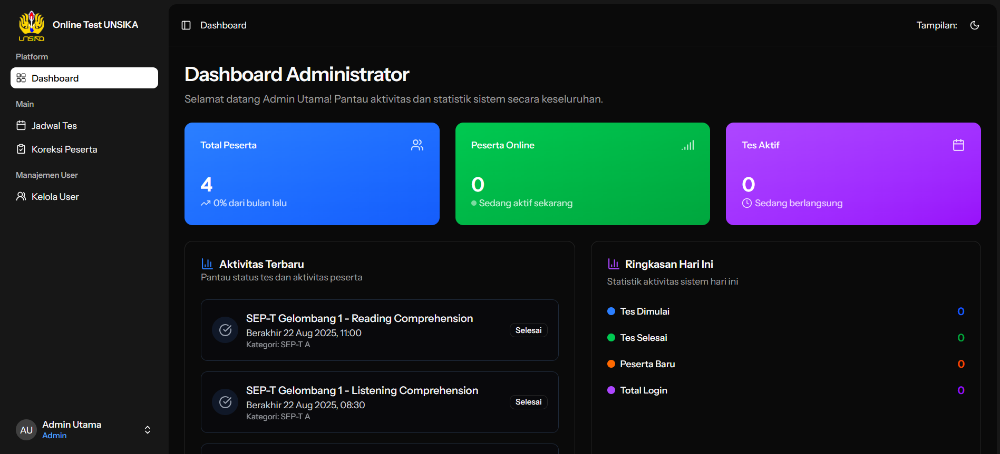
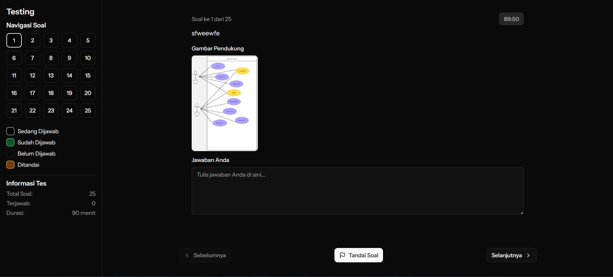
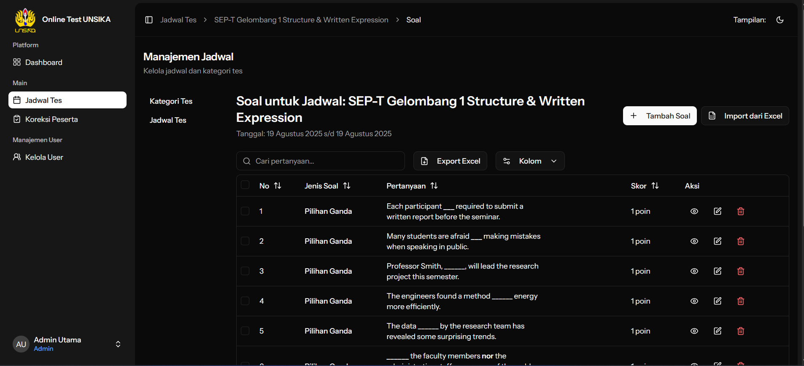

# 🎓 Sistem Tes Online UNSIKA
*UNSIKA Online Test System*

<div align="center">


[](https://laravel.com)
[](https://reactjs.org)
[](https://www.typescriptlang.org)
[](https://inertiajs.com)
[](https://php.net)

**Platform tes online modern untuk lingkungan akademik**  
*Modern online testing platform for academic environment*

</div>

---

## 📖 Tentang Proyek | *About Project*

Sistem Tes Online UNSIKA adalah platform komprehensif yang dirancang khusus untuk mendukung proses evaluasi dan ujian di lingkungan Universitas Singaperbangsa Karawang. Dibangun dengan teknologi terdepan, sistem ini menawarkan pengalaman tes online yang aman, efisien, dan user-friendly.

*UNSIKA Online Test System is a comprehensive platform specifically designed to support evaluation and examination processes in the Universitas Singaperbangsa Karawang environment. Built with cutting-edge technology, this system offers a secure, efficient, and user-friendly online testing experience.*

## ✨ Fitur Utama | *Key Features*

### 🏛️ **Manajemen Institusi | *Institution Management***
- **🏷️ Kategori Tes**: Organisasi tes berdasarkan mata kuliah atau topik  
  *Test Categories: Organize tests by subject or topic*
- **📅 Penjadwalan Fleksibel**: Atur waktu mulai dan berakhir tes dengan mudah  
  *Flexible Scheduling: Set test start and end times easily*
- **👥 Manajemen Pengguna**: Sistem role-based untuk admin, guru, dan siswa  
  *User Management: Role-based system for admin, teachers, and students*

### 📝 **Sistem Soal Canggih | *Advanced Question System***
- **🔤 Pilihan Ganda**: Soal dengan multiple choice standar  
  *Multiple Choice: Standard multiple choice questions*
- **☑️ Multi Pilihan**: Soal dengan beberapa jawaban benar  
  *Multi Choice: Questions with multiple correct answers*
- **📖 Esai**: Soal essay untuk evaluasi mendalam  
  *Essay: Essay questions for in-depth evaluation*
- **📊 Skala**: Soal dengan rating scale (Likert)  
  *Scale: Questions with rating scale (Likert)*
- **🧮 Formula Matematika**: Dukungan LaTeX untuk persamaan matematis  
  *Mathematical Formulas: LaTeX support for mathematical equations*
- **🎵 Media Pendukung**: Upload audio/gambar untuk soal  
  *Media Support: Upload audio/images for questions*

### 🛡️ **Keamanan Tes | *Test Security***
- **⏱️ Timer Real-time**: Countdown timer untuk setiap sesi tes  
  *Real-time Timer: Countdown timer for each test session*
- **🚫 Anti-Cheating**: Deteksi perpindahan tab otomatis  
  *Anti-Cheating: Automatic tab switching detection*
- **💾 Auto-Save**: Jawaban tersimpan otomatis setiap beberapa detik  
  *Auto-Save: Answers automatically saved every few seconds*
- **🔒 Sesi Terkunci**: Satu kali masuk, tidak bisa keluar hingga selesai  
  *Locked Session: Once entered, cannot exit until completion*

### 📊 **Analytics & Reporting**
- **📈 Dashboard Komprehensif**: Overview statistik tes dan peserta  
  *Comprehensive Dashboard: Overview of test and participant statistics*
- **🎯 Penilaian Otomatis**: Sistem scoring otomatis untuk objective questions  
  *Automatic Grading: Automatic scoring system for objective questions*
- **📑 Laporan Detail**: Export hasil dalam berbagai format  
  *Detailed Reports: Export results in various formats*
- **👨‍🏫 Panel Koreksi**: Interface untuk koreksi manual soal essay  
  *Correction Panel: Interface for manual essay question correction*

## 🏗️ Arsitektur Teknologi | *Technology Architecture*

### **Backend Stack**
```php
🔧 Laravel 12.0     // Framework PHP modern dengan fitur terdepan
🗄️ MySQL/PostgreSQL // Database relational untuk data persistence  
🔄 Laravel Queue    // Background job processing
📡 Inertia.js       // Server-side rendering dengan React
```

### **Frontend Stack**
```typescript
⚛️ React 18         // UI library dengan hooks modern
📘 TypeScript       // Type-safe JavaScript development
🎨 Tailwind CSS     // Utility-first CSS framework
🧩 Shadcn/ui        // Component library yang elegant
📊 React Tables     // Data tables dengan sorting & filtering
🧮 KaTeX            // Mathematical notation rendering
```

### **DevOps & Tools**
```bash
🐳 Docker           // Containerization untuk deployment
⚡ Vite             // Fast build tool dan HMR
🧪 PHPUnit          // Testing framework untuk PHP
✅ ESLint/Prettier  // Code quality dan formatting
🔄 Laravel Sail     // Docker development environment
```

## 🚀 Quick Start

### **Prasyarat | *Prerequisites***
```bash
- PHP >= 8.2
- Node.js >= 18.0
- Composer
- NPM/Yarn
- MySQL/PostgreSQL
```

### **Instalasi | *Installation***

1️⃣ **Clone Repository**
```bash
git clone https://github.com/zalzdarkent/tes_online_unsika.git
cd tes_online_unsika
```

2️⃣ **Install Dependencies**
```bash
# Backend dependencies
composer install

# Frontend dependencies  
npm install
```

3️⃣ **Environment Setup**
```bash
# Copy environment file
cp .env.example .env

# Generate application key
php artisan key:generate
```

4️⃣ **Database Setup**
```bash
# Run migrations
php artisan migrate

# Seed sample data (optional)
php artisan db:seed
```

5️⃣ **Build & Serve**
```bash
# Build frontend assets
npm run build

# Serve application
php artisan serve
```

### **Development Mode**
```bash
# Terminal 1: Laravel development server
php artisan serve

# Terminal 2: Vite development server (HMR)
npm run dev

# Terminal 3: Queue worker (for background jobs)
php artisan queue:work
```

## 👥 User Roles & Permissions

| Role | Akses | *Access* |
|------|-------|----------|
| 👑 **Admin** | Kelola pengguna, sistem, dan semua data | *Manage users, system, and all data* |
| 👨‍🏫 **Teacher** | Buat tes, kelola soal, koreksi jawaban | *Create tests, manage questions, grade answers* |
| 🎓 **Student** | Ikut tes, lihat hasil, riwayat | *Take tests, view results, history* |

## 📱 Screenshots

<div align="center">

### Dashboard Overview


### Test Interface  


### Question Management


</div>

## 🛠️ Development

### **Project Structure**
```
📦 tes_online_unsika/
├── 📁 app/                    # Laravel application core
│   ├── 📁 Http/Controllers/   # Request controllers
│   ├── 📁 Models/            # Eloquent models
│   └── 📁 Jobs/              # Background jobs
├── 📁 resources/
│   ├── 📁 js/                # React TypeScript components
│   │   ├── 📁 components/    # Reusable UI components
│   │   ├── 📁 pages/         # Page components
│   │   └── 📁 types/         # TypeScript definitions
│   └── 📁 css/               # Stylesheets
├── 📁 database/
│   ├── 📁 migrations/        # Database migrations
│   └── 📁 seeders/           # Data seeders
└── 📁 public/                # Public assets
```

### **Coding Standards**
- **PHP**: PSR-12 coding standard dengan Laravel conventions
  *PHP: PSR-12 coding standard with Laravel conventions*
- **TypeScript**: ESLint + Prettier untuk consistent formatting
  *TypeScript: ESLint + Prettier for consistent formatting*
- **Database**: Descriptive naming dengan proper indexing
  *Database: Descriptive naming with proper indexing*

## 🔧 Configuration

### **Environment Variables**
```env
APP_NAME="UNSIKA Online Test"
APP_ENV=production
APP_KEY=your-32-character-key
APP_DEBUG=false
APP_URL=https://yourdomain.com

DB_CONNECTION=mysql
DB_HOST=127.0.0.1
DB_PORT=3306
DB_DATABASE=tes_online_unsika
DB_USERNAME=your_username
DB_PASSWORD=your_password

QUEUE_CONNECTION=database
SESSION_DRIVER=database
```

##  Deployment

### **Production Setup**
```bash
# 1. Clone dan setup di server
git clone https://github.com/zalzdarkent/tes_online_unsika.git
cd tes_online_unsika

# 2. Install dependencies
composer install --optimize-autoloader --no-dev
npm ci && npm run build

# 3. Setup environment
cp .env.example .env
php artisan key:generate

# 4. Database setup
php artisan migrate --force
php artisan config:cache
php artisan route:cache
php artisan view:cache

# 5. Set permissions
chown -R www-data:www-data storage bootstrap/cache
chmod -R 775 storage bootstrap/cache
```

### **Docker Deployment**
```bash
# Build dan jalankan dengan Docker Compose
docker-compose up -d --build

# Scale services sesuai kebutuhan
docker-compose up -d --scale app=3
```

## 🤝 Contributing

Kami menyambut kontribusi dari developer lain! Silakan ikuti panduan berikut:  
*We welcome contributions from other developers! Please follow this guide:*

1. 🍴 Fork repository ini | *Fork this repository*
2. 🌿 Buat feature branch (`git checkout -b feature/AmazingFeature`)
3. 💾 Commit perubahan (`git commit -m 'Add some AmazingFeature'`)  
4. 📤 Push ke branch (`git push origin feature/AmazingFeature`)
5. 🔃 Buat Pull Request

### **Development Guidelines**
- Tulis unit tests untuk fitur baru | *Write unit tests for new features*
- Follow coding standards yang ada | *Follow existing coding standards*  
- Update dokumentasi jika perlu | *Update documentation if necessary*
- Gunakan commit message yang descriptive | *Use descriptive commit messages*

## 📄 License

Proyek ini menggunakan [MIT License](LICENSE). Bebas digunakan untuk keperluan akademik dan komersial.  
*This project uses [MIT License](LICENSE). Free to use for academic and commercial purposes.*

## 📞 Support & Contact

**Developer Team:**
- 💻 **Lead Developer**: [zalzdarkent](https://github.com/zalzdarkent)
- 🏫 **Institution**: Universitas Singaperbangsa Karawang
- 📧 **Email**: support@unsika.ac.id
- 🌐 **Website**: [https://unsika.ac.id](https://unsika.ac.id)

**Technical Support:**
- 🐛 **Bug Reports**: [GitHub Issues](https://github.com/zalzdarkent/tes_online_unsika/issues)
- 💡 **Feature Requests**: [GitHub Discussions](https://github.com/zalzdarkent/tes_online_unsika/discussions)
- 📖 **Documentation**: [Wiki](https://github.com/zalzdarkent/tes_online_unsika/wiki)

---

<div align="center">

**Dibuat dengan ❤️ untuk kemajuan pendidikan Indonesia**  
*Built with ❤️ for the advancement of Indonesian education*

---

### 🎓 UNSIKA Online Test System
**Empowering Education Through Technology**

⭐ **Jika proyek ini membantu, jangan lupa kasih star ya!**  
*If this project helps you, don't forget to give it a star!*

</div>
